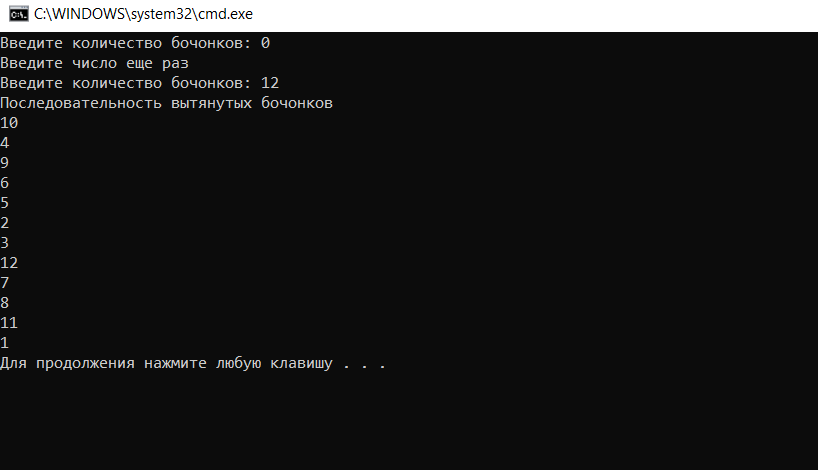

Описание программы
====================
Программа реализует жеребьевку методом генерации случайных чисел.
Входные данные - количество бочонков в мешке. Выходные данные -  последовательность номеров  бочонков, вытащенных из мешка . 

Программа написана на языке программирования Python. Открыть проект можно в среде Visual Studio. Код программы находится в файле loto.py.
